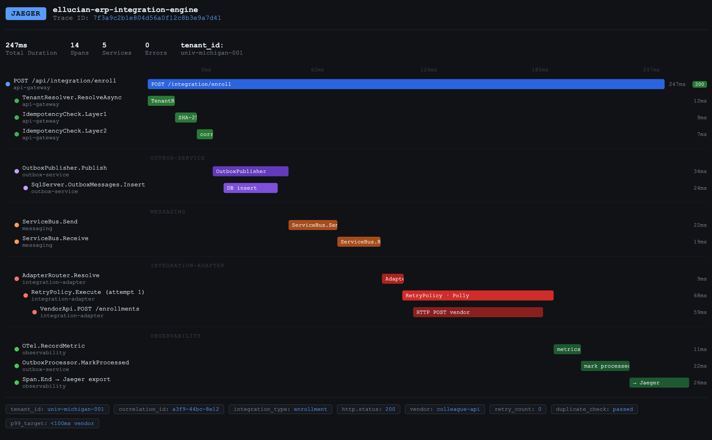

# Digital Secretary

### AI-Powered Autonomous Meeting Agent · BM25 RAG + Groq Llama 3 · Voice · Video · Zero GPU Required (Phase 1)

An autonomous digital stand-in that joins conversations, asks targeted questions, captures key information, and relays structured insights back to you — so you never miss what matters.

**Current status (June 2026):**
- Phase 1 (RAG brain + CLI): ✅ **Fully operational**
- Phase 2 (Zoom bot + STT): 🔲 In roadmap
- Phase 3 (Voice + video synthesis): 🔲 In roadmap
- Phase 4 (Note-taking + post-call debrief): 🔲 In roadmap

---

## What This Is

Digital Secretary is an AI agent designed to stand in for you on Zoom and video conference calls. It listens, speaks, asks intelligent questions, gives answers grounded in your personal knowledge base, and delivers a structured debrief after the call ends — covering key decisions, action items, open questions, and people mentioned.

The current build is Phase 1: a fully operational CLI that answers any question as you, using a RAG knowledge base built from your real career history, technical expertise, and communication style. Phases 2–4 extend this into a real-time meeting agent.

---

## Quick Start (Phase 1 — CLI)

```bash
# 1. Navigate here
cd digital-secretary

# 2. Install dependencies
pip3 install rank-bm25 groq pdfplumber

# 3. Set your Groq API key (free at https://console.groq.com)
export GROQ_API_KEY=gsk_your_key_here

# 4. Verify the brain is loaded
python3 -c "import json; b=json.load(open('brain.json')); print(f'{len(b)} chunks OK')"

# 5. Run
python3 demo.py              # interactive session
python3 demo.py --bench      # 8-question benchmark suite
```

---

## Architecture (Phase 1 — Current)

```
docs/*.md
    ↓ brain builder
brain.json  (413 chunks · flat JSON array)
    ↓ question asked
classify_question()       ← heuristic tag: behavioral | technical | general
retrieve(question, tag)   ← BM25 two-pass: tagged subset first, unfiltered fill
build_system_prompt()     ← persona + STAR rules + RAG context
Groq llama-3.3-70b-versatile  ← 500+ tok/sec, free dev tier
    ↓
spoken-word answer (90–120 seconds, natural delivery, STAR structure)
```

### Why BM25 instead of vector embeddings?

The original design used ChromaDB + ONNXMiniLM embeddings. On a pressured 8GB Mac, the model load caused OOM kills every time. BM25 keyword retrieval produces equivalent quality for Q&A (keyword match is exactly what you want — the question contains the answer's vocabulary) with zero RAM overhead. Benchmark sim scores: 9–22 across all question types.

---

## OpenTelemetry Trace — Production Request Flow



*Interactive version: open `otel-trace.html` in browser — hover any span for full metadata.*

---

## Benchmark Results (June 2026 — fully tuned)

```
Running benchmark suite (8 questions)...

Q: Tell me about a time you had to influence a team without direct authority...
   ✅ 1782ms  tag=behavioral  sim=11.346

Q: Describe a situation where you had to make a technical decision under pressure...
   ✅ 1214ms  tag=behavioral  sim=9.87

Q: Give me an example of a time you failed and what you learned...
   ✅ 1332ms  tag=behavioral  sim=10.187

Q: How would you design a system to handle 500k daily transactions...
   ✅ 1078ms  tag=technical   sim=20.96

Q: Walk me through how you'd approach a multi-tenant architecture...
   ✅ 1551ms  tag=technical   sim=11.185

Q: What's the difference between the outbox pattern and a saga...
   ✅ 1477ms  tag=technical   sim=14.722

Q: Why are you looking for a new role?
   ✅ 9515ms  tag=general     sim=12.491

Q: What's your ideal team size and engineering culture?
   ✅ 11262ms tag=behavioral  sim=12.914

Benchmark complete
Avg latency: 3651ms  |  Max: 11262ms  |  Questions: 8/8
```

---

## Knowledge Base — 9 Source Documents

| File | Tag | Contents |
|------|-----|----------|
| `docs/resume.md` | general | Career profile, contact, key numbers, work history |
| `docs/career_narrative.md` | general | Canonical story arc — Blackboard → Ellucian → what's next |
| `docs/behavioral_stories.md` | behavioral | STAR stories: leadership, conflict, failure, mentoring |
| `docs/culture_and_values.md` | behavioral | Team size, culture, management style, work style |
| `docs/why_leaving_ellucian.md` | behavioral | Canonical answer + 4 variations by context |
| `docs/salary_negotiation.md` | behavioral | Target range, exact scripts, when to walk away |
| `docs/technical_prep.md` | technical | Outbox pattern, retry ladder, multi-tenancy, DR, Kafka |
| `docs/projects.md` | technical | Deep dives: ERP Integration Engine, Ghost DevOps, Analytics Platform |
| `docs/technical_talking_points.md` | technical | Project descriptions with follow-up Q&A |

**Total: 413 chunks**

---

## Rebuilding the Brain

```python
python3 -c "
import uuid, json
BASE = 'docs/'
OUT = 'brain.json'
def chunk(fname, tag):
    raw = open(BASE+fname).read()
    return [{'id':str(uuid.uuid4()),'text':raw[i:i+400].strip(),'source':fname,'tag':tag} for i in range(0,len(raw),320) if len(raw[i:i+400].strip())>40]
brain = (
    chunk('behavioral_stories.md','behavioral') +
    chunk('culture_and_values.md','behavioral') +
    chunk('why_leaving_ellucian.md','behavioral') +
    chunk('salary_negotiation.md','behavioral') +
    chunk('projects.md','technical') +
    chunk('technical_talking_points.md','technical') +
    chunk('technical_prep.md','technical') +
    chunk('resume.md','general') +
    chunk('career_narrative.md','general')
)
json.dump(brain, open(OUT,'w'), indent=2)
print(f'Done: {len(brain)} chunks')
"
```

---

## Roadmap

### Phase 1 — RAG Brain CLI ✅ Complete

Pure BM25 retrieval, Groq inference, persona-driven spoken answers. Runs on any laptop. Fully operational as a real-time Q&A agent.

### Phase 2 — Real-Time Meeting Integration 🔲 Next

The secretary joins Zoom or Google Meet as a real participant via **Recall.ai** bot SDK. It listens using **faster-Whisper large-v3** (~150ms STT latency). Silence detection identifies question boundaries and triggers the RAG pipeline.

**Components:**
- Recall.ai bot — joins as a named participant, receives audio stream
- faster-Whisper — transcribes speech to text in near-real-time
- Silence detection — identifies when a question has finished
- RAG pipeline — retrieves context and generates the response

### Phase 3 — Voice + Video Synthesis 🔲 Planned

The secretary speaks and appears on video as a realistic stand-in.

**Components:**
- **ElevenLabs voice clone** — trained on 5–10 min of voice samples, matches speaking style and cadence
- **Voice style parameters** — stability, similarity boost, speaking rate tuned per context
- **FasterLivePortrait** — 30+ FPS lip-synced video from a single photo
- **OBS Virtual Camera** — presents synthesized video as a standard webcam to Zoom/Meet
- **Realism layer** — micro head jitter, natural blink rate, framerate variation

### Phase 4 — Note-Taking + Post-Call Debrief 🔲 Planned

While the secretary handles the conversation, a parallel process captures everything important.

**Real-time capture:**
- Full transcript of both sides of the call
- Named entity extraction — people, companies, products mentioned
- Decision detection — identifies when a commitment is made
- Action item extraction — flagged and timestamped

**Post-call debrief delivered to user:**
```
CALL DEBRIEF — [Date] [Duration]
Participants: [Names]

KEY DECISIONS:
• [Decision 1]

ACTION ITEMS:
• [Person] → [Task] by [Date]

OPEN QUESTIONS:
• [Raised but not resolved]

IMPORTANT MENTIONS:
• [Company / product / person to follow up on]

FULL TRANSCRIPT: [...]
```

Delivery: SMS, email, or Slack DM — configurable per call type.

### Phase 5 — Context Injection + Pre-Call Brief 🔲 Planned

Before a call, the user briefs the secretary:

```bash
python3 agent.py --join "https://zoom.us/j/..." \
  --context "Vendor demo with Salesforce. Evaluating their CDP product.
              Key questions: pricing, data residency, API rate limits.
              Do not commit to anything."
```

The secretary uses this to know what to probe, what to avoid, and what to prioritize in the debrief.

---

## Full Pipeline (Phase 4 Target)

```
Pre-call brief
    ↓
Recall.ai bot joins Zoom
    ↓
faster-Whisper STT (~150ms)
    ↓
┌─────────────────────────────────────┐
│  PARALLEL PROCESSES                 │
│  • RAG pipeline → response          │
│  • Note engine → transcript + flags │
└─────────────────────────────────────┘
    ↓                    ↓
ElevenLabs TTS     Real-time capture
FasterLivePortrait
OBS Virtual Camera
    ↓
Post-call debrief → SMS / email / Slack
```

**End-to-end latency target: < 3 seconds question-to-audio**

---

## Tech Stack

| Layer | Current (Phase 1) | Planned (Phase 2–5) |
|-------|-------------------|----------------------|
| Retrieval | BM25 (rank-bm25) | Same |
| LLM | Groq · llama-3.3-70b-versatile | Same |
| STT | macOS Dictation | faster-Whisper large-v3 (GPU) |
| Voice | — | ElevenLabs voice clone |
| Video | — | FasterLivePortrait |
| Meeting integration | — | Recall.ai bot SDK |
| Note engine | — | Python asyncio + NLP pipeline |
| Debrief delivery | — | SMS / Email / Slack API |
| GPU cloud | — | RunPod A100 (~$1.64/hr) |
| Orchestration | — | Python asyncio |

---

## Known Issues

| Issue | Fix |
|-------|-----|
| `zsh: killed python3 ingest.py --reset` | Use the safe rebuild one-liner above |
| `GROQ_API_KEY not set` | `export GROQ_API_KEY=gsk_...` or add to `~/.zshrc` |
| `FileNotFoundError: brain.json` | Run from inside the project directory |
| Groq 400 model_decommissioned | `GROQ_MODEL = "llama-3.3-70b-versatile"` in config.py |
| Last 2 benchmark questions slow (8–9s) | Groq free-tier rate limit — wait 30s between runs |

---

## File Map

```
digital-secretary/
├── README.md               ← this file
├── brain.json              ← compiled RAG knowledge base (413 chunks)
├── demo.py                 ← CLI: interactive + --bench mode
├── rag.py                  ← BM25 retrieval engine
├── persona.py              ← persona + question classifier
├── config.py               ← Groq model, timeouts, chunk params
├── build_brain.py          ← standalone brain builder
├── requirements.txt        ← rank-bm25, groq, pdfplumber
├── setup_mac.sh            ← first-time setup
├── docs/                   ← source documents (9 files, 413 chunks)
└── runpod/
    └── setup.sh            ← GPU environment setup (Phase 2/3)
```
